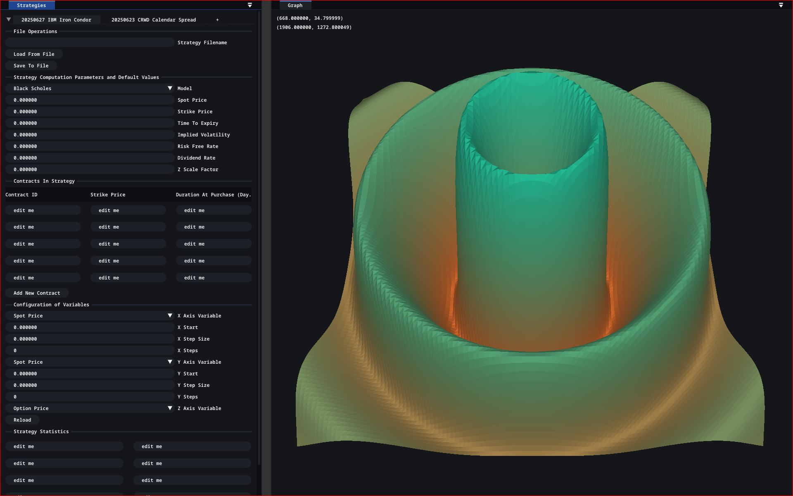

# Financial Derivatives Visualization System (FDVS)



This doesn't have any data yet, and the Strategies panel isn't connected to the Graph panel. This is a proof of concept and is for demonstration purposes only.

## Description

> **Note:** Right now, the project can't do most of the things described below, but it can display a 3D graph from a compiled Linux `.so`, which seems to be quite useful on its own.  Any compiled function that has the signature (float)(double, double) can be plotted, and it need not have a closed mathematical form either.  Plus, the fact that it is GPU-rendered and already incorporates so much ImGUI boilerplate means that it is a somewhat usable starting point for many plotting purposes.

In the course of my study of options pricing, I have found it, at times, difficult to fully comprehend the dynamics of complex options strategies and follow them as asset prices move. From a purely theoretical point of view, using the Black-Scholes model and seeing some 3D plots of various strategies would largely suffice. In fact, most textbooks just introduce 2D P/L graphs and have the reader imagine the other dynamics. But in actual trading, I find that, especially with strategies involving multiple expiries (e.g., calendar spreads) and even shares of underlying equities, it is rather difficult to keep track of how markets are moving relative to the initial trading hypothesis. Most CPU-rendered plotting libraries are very slow, and though some GPU-rendered plotting libraries have emerged, I still feel like there is a need for a specialized system that corresponds to these specific needs. My hope is that, as I study more mathematics, statistics, pricing models, and time-series analysis methods, I can incorporate them into this system.

I have two main goals. Firstly, from a learning point of view, this project seems to be a nice learning tool, as it touches on a variety of subjects, from mathematics to networking to computer graphics. On the other hand, I do believe that there is considerable utility in a system that can easily and intuitively convert complex derivatives trading hypotheses that often depend on multiple variables, such as volatility, interest rates, expiries, etc., into a visualization on screen that interactively displays its correspondence to real-world market data. I really do enjoy 3Blue1Brown's videos and the Manim library he wrote; this is an attempt to create an interactive dashboard that displays graphics and animations in that style in a way that connects imagination with real-world data. Hopefully, components of it can find broader utility outside of finance.

## Current State of Development

I left the project dormant for a year or so as I dealt with other things in life. After coming back to it, I started with some housekeeping work. I stopped using CGAL for its `advancing_front_surface_reconstruction`, as that was a bit overkill. I hacked up a function that generates a grid of triangular primitives manually, and it seems to work fine. Though, I anticipate that some changes are needed to deal with bounds adjustment and randomization (which I hope can help with certain spiky features). I fixed the `CMakeLists` so that it compiles two or so targets instead of a dozen. I am still learning how all of this works. I made the ImGui dockspace work by removing all the ImGui context-switching code. I dug around a bit in ImGui's demo code and discovered that there was a variable in the `ImGuiContext` I could use to detect the focused window, so I no longer needed to maintain two contexts, and the dockspace now works fairly naturally. I also included a `.gitignore`, so that I can finally stop tracking all the CMake cache files.

Right now, the main useful thing one can do with this project is 3D graphing. I haven't yet configured the GUI to work properly, but I did make up a temporary interface that I think is rather neat. I dug up `dlopen` from the man pages, and I made it so that the program dynamically loads, from a file called `libfunc.so`, a function called `f` and plots it on a grid (right now, the grid size is hard to change, but I will fix that later). For any function you want to plot, so long as it takes two doubles and outputs a float (I chose a float in order to be compatible with the GPU interface), simply compile it to a `.so`, and the program will plot it. The function need not have a mathematical form.

```bash
gcc -shared -fPIC ./src/toplot.c ./build/libfunc.so -lm
```

I think this feature is quite useful by itself. A lot of conventional libraries used for 3D plotting are quite slow, as they are rendered on the CPU. Some others only admit functions with a closed mathematical form. There are libraries like CERN's ROOT, but there's quite a learning curve there. There are also newer Python projects that solve this original problem of mine, but this simplistic design and incredible flexibility could prove to still provide some utility. There is almost no learning curve. Any \(R^2 \rightarrow R\) function can be plotted, with appropriate scaling. And the ecosystem surrounding C means that it is fairly easy to create whatever function you desire. You can run a Monte Carlo simulation and plot it; you can use OpenCL (or CUDA?) to do some simulation or calculation and plot it. Plus, the ImGui boilerplate already roughly built out gives a starting point for adding some GUI interactions to your plotting dashboard/application. It is fairly easy to add in something like a slider, and the GPU rendering ensures that the response times are almost instantaneous.

## Todo

### Fixes

There are a lot of graphics problems that I have yet to fix. The fragment shader is pretty bad. The lighting has problems. For example, the back side of the model is not illuminated. I just haven't spent much time on it yet. There seem to be clipping problems as well. I am not very clear on what's going on there. I am also hoping that setting up antialiasing would help the overall appearance. The coloring logic is also slightly problematic.

The keyboard/mouse interactions are pretty bad. I think the problem is that I am moving the camera instead of the model. Especially when you mix rotations and translations, the movement of the model gets rather funky. Keyboard inputs allow for more degrees of motion, and though it is somewhat awkward, it is possible to get back to where one started from; it is just not very intuitive. I think I should be going to the model's reference frame (which involves finding the model's centre and its up, forward, and lateral vectors) and rotating the model about its own axes; then go to the camera's reference frame to zoom in or out. This way, we separate the rotation and translation in a sense, and hopefully that improves things. Bounds and scaling for our grid are another thing to fix.

Currently, the Strategies panel on the left is not connected to graph generation. I want to first make the graphics sound before connecting the data-generation components.

### Roadmap

**Graphing.** There are the basic things, like adding axes and labels. ImGui has functions that make it quite a bit easier to draw text on screen. There should be no need to fiddle with font atlases and direct OpenGL texturing. Then, we have certain functionalities that are easy to add. For example, 2D plotting is just 3D plotting with the z-coordinate fixed. Bar graphs are just a bunch of rectangles. There is some layout logic and some scaling logic, but that should not be too difficult. Further out in the roadmap, I do want candlestick charting (wouldn't it be fun to display a candlestick chart in 3D? For example, if you add a variable like volatility to a normal time/P&L chart and use it to annotate a surface calculated from simulations). Regardless, fundamentally, the abstraction should be the same. Any graph is fundamentally displaying some relationship between the variables of an underlying data-generating process. There should be a clear separation between the data-generating process and its projection or presentation onto the screen. In most cases, it is beneficial to stick to a simple abstract interface between the two things, like \(R^2 \rightarrow R\).

We would also probably need a pivot table of some sort that prints out basic statistics about a strategy.

**Data.** On the topic of data-generating processes, the first step is to link our Strategies panel to the Graph panel. I have already implemented the Black-Scholes pricer for the project. My previous plan was to read a JSON file specifying the strategy (a combination of options contracts and underlying equities) we employ and pass it to the pricer. However, I feel that parsing JSON is unnecessary performance overhead. So, I will look into some binary serialization/deserialization framework, like Protobuf or FlatBuffers, that can serialize my C++ objects into a binary file. The rough configuration now is for pricers to be objects composed into strategies, and strategies own various contracts. Strategies inherit from an `R2RFuncsGenerator` interface (I might remove this in favor of the `std::invocable` concept). The reason that strategies can't be priced by the pricer is because the pricer can only price options, and a strategy may consist of underlying equities.

In terms of blue-sky thinking, we can do better. Data-generating processes include two main things: data streams (including historical data) from vendors and functions that act on data streams. For the data stream, eventually, we will write a C++ library that connects with all the major API protocols, such as WebSockets. Though there is probably a preexisting library out there, I do need the practice in networking.

For functions that act on data streams, there are various things that we can explore. We can use OpenCL, Vulkan Kompute, or CUDA for running pricing algorithms on the GPU. These pricing workloads are fairly parallelizable. As I study more about stochastic processes and other math, I can incorporate other pricing algorithms for various sorts of contracts, e.g., interest-rate modeling methods like the Vasicek model, fixed-income options pricing, credit derivatives pricing, exotic options (like lookback options), Monte Carlo simulations for pricing as well as risk modeling, FX modeling, etc. It is also possible to overlay regression analyses and other time-series analysis methods.

### Summary

**Graph Panel**

```text
[] Fragment Shader
    [] Coloring
    [] Lighting
[] Antialiasing
[] Clipping
[] HCI
[] Base Grid Bounds Scaling and Sampling Density

[] Labels and Axes for Graphs
[] 2D Plotting
    [] Line Graphs
    [] Bar Charts
    [] Candlestick Charts
[] 3D Line/Candlestick Graph
```

**Data Generation**

```text
[] Protobuf, FlatBuffers, etc.
[] API Access Library (for various protocols like WebSockets)
[] Other Pricing and Time-Series Analysis Algorithms
```

**New Panels**

```text
[] Config Panel
[] Pivot Table/Dataviewer Panel
```

## Build

This project mainly depends on ImGui, GLFW, GLAD, and currently `nlohmann::json` (though I'm thinking about moving away to a binary representation like Protobuf). These libraries are chosen to be fairly cross-platform, so it should work on Windows. (Side note: the project currently depends on `dlopen`, which is part of the POSIX standard, so it will not work on Windows. However, this is anticipated to be temporary, and in the future, I will explore platform detection and add DLL support.)

These dependencies are also automatically handled. Some of them are in the `extern` folder. For others, CMake will automatically fetch them from the GitHub repositories. To build the project, simply run:

```bash
mkdir build
cmake -S . -B ./build --preset=default
cd build
ninja
```

Note that, as configured, CMake uses Ninja as the generator. So, please feel free to modify the `CMakePresets.json` file to change the generator settings. Also, for some reason (related to a peculiarity with my system), I decided to hard-code the path to GCC in there. That might break things on Windows, so one might have to change the `CMAKE_CXX_COMPILER` settings. To enable debug symbols, use the debug setting. Note that CMake will generate a `compile_commands.json` file that your LSP, such as Clang, can use. I haven't tried any of this on Windows, so I am not sure how to generate a Visual Studio solution file yet; though, I imagine it wouldn't be too difficult.

## Contributions

I would be greatly honored if anyone takes an interest in this project. Please feel free to open a pull request or submit an issue. Any guidance or indication of interest in such a project is also greatly welcome. I believe you can send a reply on the welcome post in "Discussions."

Please bear in mind that I am a newly admitted college freshman and I am just learning most of this stuff, so the code is somewhat questionable. I started this project some years ago, at the beginning of high school.


(I had the computer fix some spelling and grammar problems for me.)
